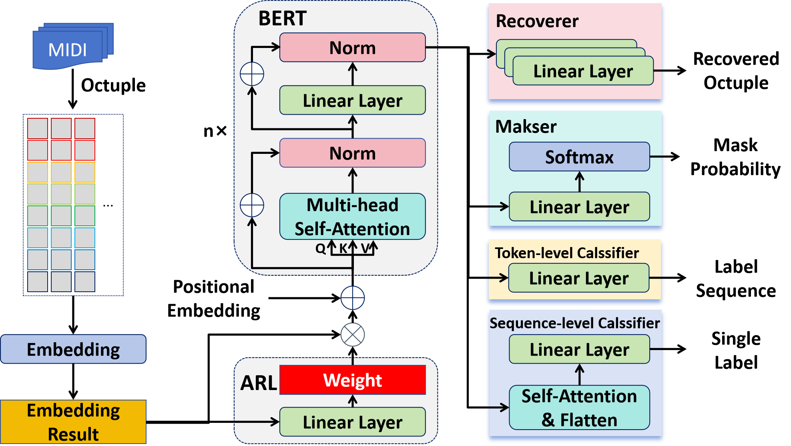
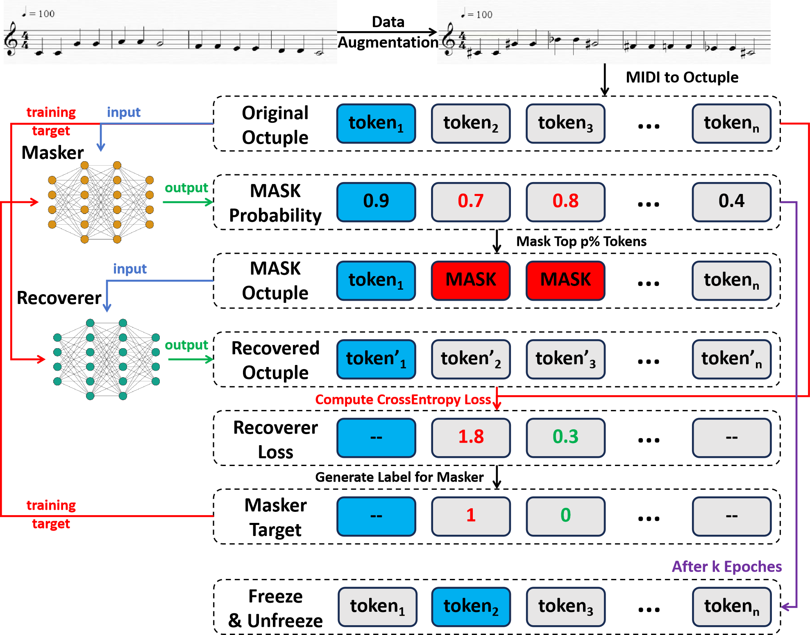

# Adversarial-MidiBERT

**Article:** Zijian Zhao*, “[Let Network Decide What to Learn: Symbolic Music Understanding Model Based on Large-scale Adversarial Pre-training](https://dl.acm.org/doi/abs/10.1145/3731715.3733483)”, ACM ICMR 2025

**Notice:** We have uploaded our model and pre-trained parameters to [Hugging Face](https://huggingface.co/RS2002/Adversarial-MidiBERT).




Some parts of our code are based on [wazenmai/MIDI-BERT: This is the official repository for the paper, MidiBERT-Piano: Large-scale Pre-training for Symbolic Music Understanding. (github.com)](https://github.com/wazenmai/MIDI-BERT).

## 1. Dataset

The datasets we used in the paper include POP1K7, POP909, Pinaist8, EMOPIA, and GiantMIDI.

You can refer the detail in our previous work [PianoBART](https://github.com/RS2002/PianoBart). To run the model, you also need the dict file in this repository.

## 2. Pre-train



```bash
python pretrain.py --dict_file <the dictionary in PianoBART>
```

To run the model, you need to place your pre-training data in `./Data/output_pretrain`.

## 3. Fine-tune

```bash
python finetune.py --dict_file <the dictionary in PianoBART> --task <task name> --dataset <dataset name> --dataroot <dataset path> --class_num <class number> --model_path <pre-trained model path> --mask --aug
```

If you do not want to use pre-trained parameters, you should add `--nopretrain`.
If you do not want to use mask fine-tuning or data augmentation, you should delete the `--mask` or `--aug`.

## 4. Citation

```
@inproceedings{zhao2025let,
  title={Let Network Decide What to Learn: Symbolic Music Understanding Model Based on Large-scale Adversarial Pre-training},
  author={Zhao, Zijian},
  booktitle={Proceedings of the 2025 International Conference on Multimedia Retrieval},
  pages={2128--2132},
  year={2025}
}
```

