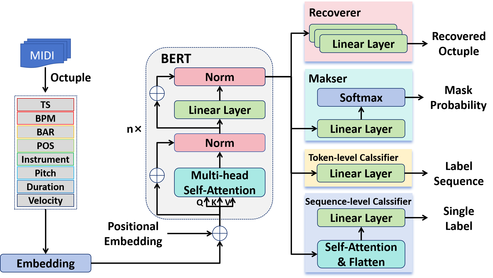

# Adversarial-MidiBERT

**Article:** Zijian Zhao*, “[Adversarial-MidiBERT: Symbolic Music Understanding Model Based on Unbias Pre-training and Mask Fine-tuning (arxiv.org)](https://arxiv.org/abs/2407.08306)”




Some parts of our code are based on [wazenmai/MIDI-BERT: This is the official repository for the paper, MidiBERT-Piano: Large-scale Pre-training for Symbolic Music Understanding. (github.com)](https://github.com/wazenmai/MIDI-BERT).


## 1. Dataset

The datasets we used in the paper include POP1K7, POP909, Pinaist8, EMOPIA, and GiantMIDI.

You can refer the detail in our previous work [PianoBART](https://github.com/RS2002/PianoBart). To run the model, you also need the dict file in this repository.


## 2. Pre-train


```bash
python pretrain.py --dict_file <the dictionary in PianoBART>
```

To run the model, you need to place your pre-training data in `./Data/output_pretrain`.


## 3. Fine-tune

```bash
python finetune.py --dict_file <the dictionary in PianoBART> --task <task name> --dataset <dataset name> --dataroot <dataset path> --class_num <class number> --model_path <pre-trained model path> --mask --aug
```

If you do not want to use pre-trained parameters, you should add `--nopretrain`.
If you do not want to use mask fine-tuning or data augmentation, you should delete the `--mask` or `--aug`.